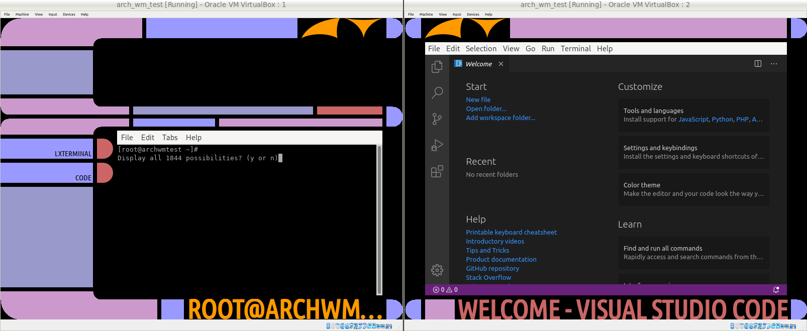
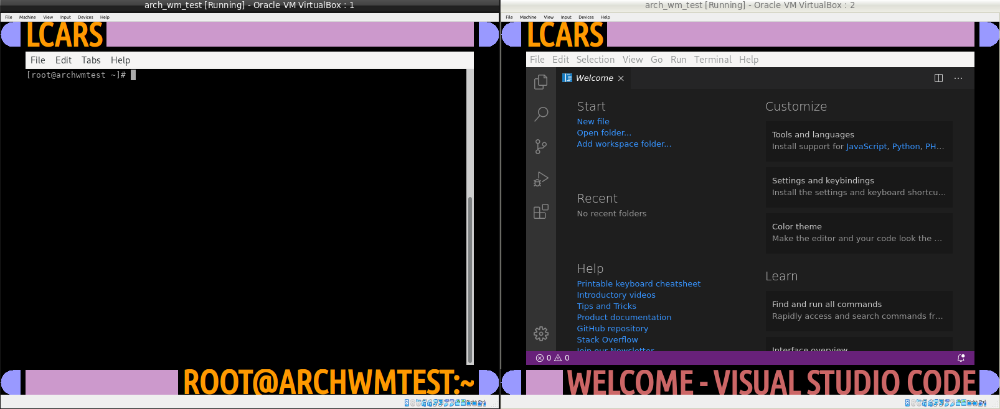
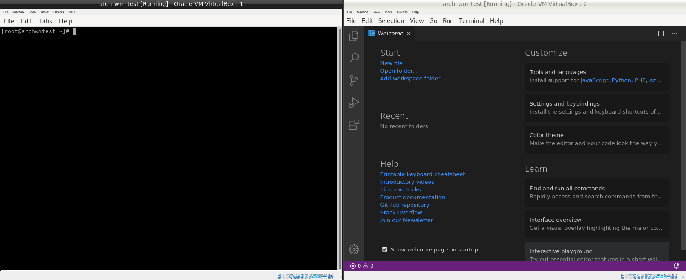

# lcarswm
It's a window manager written in Kotlin that is designed to look like an LCARS interface.

lcarswm has two kinds of monitors, one primary monitor (which maps to the X primary monitor) and "other" monitors. Only the primary screen has the upper (currently empty) information area and the side bar that shows the app menu. The information area and the app menu are only visible in the normal screen mode. There are three screen modes:
* Normal mode: app menu and information area on the primary screen, upper and lower bars on the other screens
* Maximized mode: upper and lower bars on all screens
* Fullscreen mode: no bars, windows are maximized

If there's no primary screen defined in the X server, then lcarswm will use the first monitor it finds as primary.

lcarswm is a stacking window manager and displays one window at a time per screen. Windows always open on the primary monitor and can be moved to other monitors with keyboard short cuts.

## Acknowledgements
Thank you very much to the creators of the following resources:
* [Chuan Ji - How X Window Managers Work, And How To Write One](https://jichu4n.com/posts/how-x-window-managers-work-and-how-to-write-one-part-i/)
* [openbox on github](https://github.com/danakj/openbox)
* [mcwm on GitHub](https://github.com/mchackorg/mcwm)
* [XCB implementation of TinyWM on GitHub](https://github.com/stefanbidi/tinywm-xcb)
* [XCB tutorial](https://www.x.org/releases/X11R7.7/doc/libxcb/tutorial/index.html)
* [How to read XPM files and draw them in a window](http://www.dis.uniroma1.it/~liberato/screensaver/image.html)
* [libXpm API](https://fossies.org/dox/libXpm-4.7/files.html)

## Functionality
* Window title bar, with window name and different colors for active and inactive windows
* App menu in the normal screen mode on the primary screen that lists all active windows with
  * a window selection button (blue with program name)
  * a close button (red, small without text)
* Windows-key + Q closes the window manager
* Windows-key + M toggles the display mode between normal, maximized and fullscreen
* Alt-key + Tab toggles through the windows
* Alt-key + Up/Down moves the active window to other monitors
* Alt-key + F4 closes the active window
* Windows are resized when the screen resolution is changed and the size depends on the window manager mode.
* Other key combinations can be connected to commands via a key configuration file
  * The key configuration file is expected to be `~/.config/lcarswm/key-config.properties`
  * Modifier keys are
    * Shift
    * Ctrl
    * Alt
    * Win / Lin / Super
    * Meta
    * Hyper
  * An example layout is this:
  ```properties
    Alt+T=lxterminal
    Alt+B=firefox
    XF86AudioMute=amixer set Master toggle
    XF86AudioRaiseVolume=amixer set Master 3%+
    XF86AudioLowerVolume=amixer set Master 3%-
  ```

## Pictures
Here are some pictures from the VirtualBox test environment.

Normal mode


Maximized mode


Fullscreen mode


## Required
### For compiling
* ncurses5-compat-libs: apparently libtinfo.so.5 is used by the compiler, which is part of this package.
* header files and development libraries for XLib, randr, xpm, glib and pango. Check the travis yaml file to find the build dependencies in the install routines for Ubuntu.

### For using
* Ubuntu Condensed font: It comes close enough to LCARS letters and is used by lcarswm for writing.
* Libraries for XLib, randr, xpm, glib and pango. Check the travis yaml for details via the corresponding dev libs.
* Python 3.8 with Python 3 gi and Python 3 posix-ipc packages for the app menu

## Known issues
* If screens lay over one another they are not "merged" but draw over one another

## To Do
* Associate child screens with their parents
* Center popups and adjust the frame to their size
* Content for the data bar (empty upper area in normal mode)
  * Configurable plugin framework
  * Time
  * Master volume
  * Heat signature
  * Processor usage
  * Memory usage
  * Connection state of network interfaces
  * Data throughput of network interfaces
  * ...
* GTK-Theme (if I can't find one)
* Configuration for the colors
* Monitors
  * Merge overlaying screens of same size
  * If screens have different sizes, the higher one draws
* check for XDG-path variables and have a fallback
* toggle window list by latest used application

## Logo
The logo is a xpm file. It needs to be located in /usr/share/pixmaps and must be named lcarswm.xpm. It can be exchanged. The only restriction is that the logo height needs to be 40px. The bars will adjust to the width.

## Automated testing
Automated tests are set up using Travis CI. It's working well except for the fact, that the whole environment is downloaded again for every test run. That means downloads of over 500MB, which takes time. However, it's working and that's good enough for me for now.

System tests are created using a mocked system facade, that covers all calls to Xlib, POSIX and other things. The difficulty lies within guessing the behavior of the mocked system though, in cases where calls would be dependent on each other when using the actual libraries.

## Manuel testing / running the wm
To manually test the functionality, I've set up a virtual Linux machine in VirtualBox with a shared directory to the generated executables. In this virtual environment, I run the window manager like this:

```
export XDG_CONFIG_HOME="$HOME/.config"
startx /path/to/executable/lcarswm.kexe
```

That runs the X window manager with the lcarswm window manager. The .config folder in the home directory should contain an lcarswm folder with a key-config.properties file with the configuration for the key bindings (see the example file in `src/nativeMain/resources/homedir/.config/lcarswm`).

lcarswm creates a log file at the path `/var/log/lcarswm.log`.

Probably one of the most interesting features in using a VM and RANDR is screen resizing. For me this works with using VBoxVGA as graphics controller and `VBoxClient-all` needs to be called after the activation of X to allow for resizing detection and all other things VBoxClient offers. Alternatively, VBoxClient can be called with specific flags.
