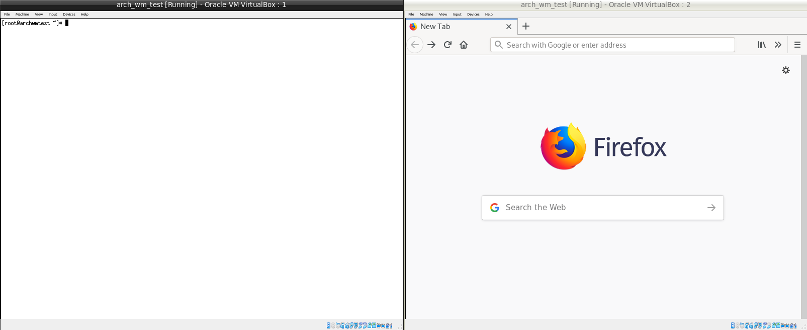

# lcarswm
It's a window manager written in Kotlin. The goal is to finish it and if that happens to happen, it will look like an LCARS interface.

## Acknowledgements
Thank you very much to the creators of the following resources:
* [Chuan Ji - How X Window Managers Work, And How To Write One](https://jichu4n.com/posts/how-x-window-managers-work-and-how-to-write-one-part-i/)
* [mcwm on GitHub](https://github.com/mchackorg/mcwm)
* [XCB implementation of TinyWM on GitHub](https://github.com/stefanbidi/tinywm-xcb)
* [XCB tutorial](https://www.x.org/releases/X11R7.7/doc/libxcb/tutorial/index.html)
* [How to read XPM files and draw them in a window](http://www.dis.uniroma1.it/~liberato/screensaver/image.html)
* [libXpm API](https://fossies.org/dox/libXpm-4.7/files.html)

## Functionality
* Windows-key + Q closes the window manager
* Windows-key + T opens xterm
* Windows-key + B (Browser) opens Firefox
* Windows-key + I opens IDEA (chosen because it has some popup windows when opening tha application and they don't render correctly yet)
* Windows-key + Tab toggles through the windows
* Windows-key + Up/Down moves the active window to other monitors
* Windows-key + M toggles the display mode between normal, maximized and fullscreen
* Windows are resized when the screen resolution is changed and the size depends on the window manager mode.

## Pictures
Yay, it's starting to get somewhat usable. So here are some pictures from the VirtualBox test environment.

Normal mode


Maximized mode


Fullscreen mode


## Required
* ncurses5-compat-libs: apparently libtinfo.so.5 is used by the compiler, which is part of this package.
* header files and libraries for XLib, randr and xpm. Check the travis yaml file to find the build dependencies in the install routines for Ubuntu.

## Known issues
* Some popups don't render (noticed on IntelliJ startup tips popup)
* Popups probably shouldn't be scaled, but instead centered in the window area
* lxterminal doesn't render until it went through a switch of the active application

## To do
* Configuration for application key bindings
* Application selector
* Content for the data bar (empty upper area in normal mode)
  * Time
  * Master volume
  * Heat signature
  * Processor usage
  * Memory usage
  * ...
* Key bindings for
  * Volume keys
  * Application selection
* GTK-Theme (if I can't find one)

## Optional to do
* Configuration for the colors

## Some definitions
* Height of top and bottom bar: 40px
* Width of height and bottom bar ends: 32px
* Width of bar gaps: 8px
* Corner pieces have an inner corner with radius: 10px
* Random data area height: 100px
* Width of normal mode side bar: 184px

## Logo
The logo is a xpm file. It needs to be located in /usr/share/pixmaps and must be named lcarswm.xpm. It can be exchanged. The only restriction is that the logo height needs to be 40px. The bars will adjust to the width.
## Notes to myself :-)
* The main method needs to be outside of any packages so that the compiler can find it.

## Sources
There are common* and native* source directories under `src`. Everything that interacts with XLib or other native resources is in native. Everything that has no native dependency is in the common* directories. The goal is to keep the native code as small as possible and put as much as possible in the common part.

## Automated testing
Automated tests are set up using Travis CI. It's working well except for the fact, that the whole environment is downloaded again for every test run. That means downloads of over 500MB, which takes time. However, it's working and that's good enough for me for now.

What's not working so far is system testing. I'd like to have tooling, that creates mocks from the generated Kotlin functions and when testing, the code works with the mocks and not compiling against the libraries. If you happen to something that does that, then write me :-).

## Manuel testing / running the wm
To manually test the functionality, I've set up a virtual Linux machine in VirtualBox with a shared directory to the generated executables. In this virtual environment, I run the window manager like this:

```
startx /path/to/executable/lcarswm.kexe > logfile 2>$1
```

That runs the X window manager with the lcarswm window manager and writes all standard and error log output into the file "logfile". The window manager seems to keep hanging in initialization. I think it's the output forwarding that causes the problems, but so far I didn't check what exactly is happening. Running the window manager once without the output forwarding seems to help:

```
startx /path/to/executable/lcarswm.kexe
```

Probably one of the most interesting features in using a VM and RANDR is screen resizing. For me this works with using VBoxVGA as graphics controller and `VBoxClient-all` needs to be called after the activation of X to allow for resizing detection and all other things VBoxClient offers. Alternatively, VBoxClient can be called with specific flags.
